<div align="center">

<!-- Animated Typing SVG Header -->
<a href="https://git.io/typing-svg">
  
</a>

<br/>

<!-- Animated Badges -->


<br/><br/>

<!-- Animated description -->


<br/>

<!-- Wave Separator -->


</div>

---

## 🎯 The Problem

<table>
<tr>
<td>

> **Manual competitor research is broken.**
>
> Keeping tabs on what competitors are running in the Meta Ads Library means scrolling through the library by hand, eyeballing which ads have been live the longest, and manually noting the hook, visual style, copy angle, and CTA for each one.
>
> It's **slow**, **inconsistent** between team members, and produces notes that are **hard to compare or search** later. There's no easy way to turn _"I saw this ad running for months"_ into structured, filterable data your team can actually act on.

</td>
<td width="300">

```
 ❌ Manual scrolling
 ❌ Inconsistent notes
 ❌ No structured data
 ❌ Can't filter or search
 ❌ Hours wasted weekly
```

</td>
</tr>
</table>

---

## ✅ The Solution

This workflow automates the **entire research loop** end to end:

<table>
<tr><td>

| Step | Action | Details |
|:---:|:---|:---|
| 🔍 | **Scrape** | Queries Meta Ads Library via Apify `facebook-ads-library-scraper` for given search terms & countries |
| 🎯 | **Filter** | Keeps only ads running **30+ days** — a proxy signal for likely winners |
| 🧹 | **Normalize** | Maps raw output into clean fields: Library ID, company, status, days running, platform, headline, body, CTA, landing page, launch date |
| 🤖 | **Classify with AI** | Gemini 2.5 Flash analyzes each ad against a controlled vocabulary → structured JSON (hook type, visual format, copy angle, CTA, longevity, result label) |
| 📊 | **Log** | Parses AI output and appends a new row per ad to Google Sheets |
| 📲 | **Notify** | Sends a Telegram message summarizing the run |

</td></tr>
</table>

> [!TIP]
> The result is a **living, structured spreadsheet** of competitor ad creative — built without anyone manually copying and pasting from the Ads Library.

---

## 🏗️ Architecture

```mermaid
flowchart LR
    A["🔘 Trigger"] --> B["🌐 HTTP Request\n(Apify Scraper)"]
    B --> C["🎯 Filter\n(30+ Days)"]
    C --> D["🧹 Edit Fields\n(Normalize)"]
    D --> E["🤖 AI Agent\n(Gemini 2.5 Flash)"]
    E --> F["💻 Code\n(Parse JSON)"]
    F --> G["📊 Google Sheets\n(Append Row)"]
    G --> H["⏳ Wait"]
    H --> I["📲 Telegram\n(Notification)"]

    style A fill:#FF6D5A,stroke:#FF6D5A,color:#fff
    style B fill:#4285F4,stroke:#4285F4,color:#fff
    style C fill:#FBBC04,stroke:#FBBC04,color:#000
    style D fill:#34A853,stroke:#34A853,color:#fff
    style E fill:#9334E6,stroke:#9334E6,color:#fff
    style F fill:#FF6D5A,stroke:#FF6D5A,color:#fff
    style G fill:#34A853,stroke:#34A853,color:#fff
    style H fill:#888888,stroke:#888888,color:#fff
    style I fill:#26A5E4,stroke:#26A5E4,color:#fff
```



---

## 👥 Target Audience

<div align="center">

| | Role | Use Case |
|:---:|:---|:---|
| 🎯 | **Performance Marketers** | Reverse-engineer what's working in competitors' paid campaigns before building creative briefs |
| 🏢 | **Marketing Agencies** | Run repeatable creative research across multiple client accounts without extra manual hours |
| 📱 | **Digital Marketers** | Keep an always-on pulse on messaging and creative trends without manually browsing the Ads Library |
| 🚀 | **Growth Marketers** | Spot creative patterns (hooks, formats, angles) worth testing, backed by longevity data instead of gut feel |

</div>

---

## 🛠️ Tech Stack

<div align="center">

<a href="https://n8n.io"></a>
<a href="https://apify.com"></a>
<a href="https://deepmind.google/technologies/gemini/"></a>
<br/>
<a href="https://www.google.com/sheets/about/"></a>
<a href="https://telegram.org"></a>
<a href="https://www.facebook.com/ads/library/"></a>

</div>

---

## ⚡ Quick Setup

<details>
<summary><b>📋 Click to expand setup instructions</b></summary>
<br/>

### 1️⃣ Import the Workflow

```bash
# Import Workflow.json into your n8n instance
# File → Import from File → select Workflow.json
```

### 2️⃣ Connect Your Credentials

Add your own credentials for each node (all credential references were stripped before publishing):

| Node | Credential Type |
|:---|:---|
| HTTP Request | **Apify API** key |
| AI Agent (Chat Model) | **Google Gemini (PaLM) API** key |
| Append Row | **Google Sheets OAuth2** |
| Send a text message | **Telegram Bot API** token |

### 3️⃣ Replace Placeholder Values

| Placeholder | Where | Replace With |
|:---|:---|:---|
| `YOUR_GOOGLE_SHEET_ID` | Google Sheets node + Telegram message | Your target spreadsheet ID |
| `YOUR_TELEGRAM_CHAT_ID` | Telegram node | Your Telegram chat ID |

### 4️⃣ Configure Your Search

Edit the Apify request body on the HTTP Request node to set your own:
- `searchTerms` — keywords to search for
- `countries` — target countries
- `maxAds` — maximum number of ads to pull

### 5️⃣ Run It

> Trigger the workflow manually, or swap the Manual Trigger for a **Schedule Trigger** to run it on a recurring basis.

</details>

---

## ⚠️ Important Notes

> [!IMPORTANT]
> The **"result"** field is a longevity-based proxy, **not real performance data**. The Meta Ads Library doesn't expose spend, CTR, or ROAS for standard ads — so "likely winning" is inferred from how long an ad has stayed active.

> [!WARNING]
> **No API keys, OAuth tokens, or personal identifiers** (chat IDs, spreadsheet IDs, instance ID) are included in this repo. You'll need to connect your own credentials after import.

---

## 📜 License

No license specified yet — add one (e.g. MIT) if you want others to reuse or modify this workflow.

---

<div align="center">

<!-- Animated Footer -->


<br/><br/>

<!-- Wave Bottom -->


</div>
